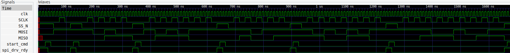

# SPI Master SystemVerilog Module

Implemented and validated an SPI master module per the [implementation details][spec], operating in SPI Mode 0 (CPOL = 0, CPHA = 0) as illustrated in Figure 1.

|  |
|:--------------------------------------------------:|
| _Figure 1:_ SCLK idles low with high SS_N, while MOSI is shifted and MISO is sampled on each falling and rising SCLK edge respectively; depicted for the first six manual transactions in `tb_spi_drv.sv`. |

[spec]: docs/spec.md


## Design Choices

`clk_div` is implemented as a fully general-purpose, parameterizable clock divider module employing a modulo-`CLK_DIVIDE` counter driven by the host clock. When the counter reaches half of the divide value, it toggles on the idle-low `clk_out` to produce a 50% duty cycle, and simultaneously generates the `strobe_rise` and `strobe_fall` pulses exactly one host clock cycle before each respective rising and falling `clk_out` edge. Utilizing these strobe signals, rather than directly sampling `SCLK`, effectively leverages the host system's dedicated clocking resources, providing accurate triggering on both positive and negative edges of `SCLK`. Specifically, as `MISO` is inherently synchronous with `SCLK`, no extra synchronization logic is necessary, and `strobe_rise` is employed to latch `MISO` data on the subsequent rising edge of the host clock, aligning precisely with `SCLK`’s rising edge, while `strobe_fall` is utilized to shift the next `MOSI` bit on the following host clock edge, ensuring deterministic and robust timing.

Additionally, instead of gating the divided `clk_out` signal with the `~SS_N` enable—which can introduce uncertainty when enable and counter rollover coincide—the design idles `SCLK` low following the final falling edge, thus maintaining the necessary half-bit-period delay before deasserting `SS_N` by allowing the internal `clk_div` counter to continue uninterrupted for consistent timing integrity.


## Repository Structure

```
docs/
rtl/
├── clk_div.sv
├── spi_drv.sv
tb/
├── tb_spi_drv.sv
waves/
├── spi_wave.vcd
work/
Makefile
README.md
```

- **rtl/**: SystemVerilog source for the SPI master and its helper modules.
- **tb/**: Testbench performing manual and randomized SPI transactions using the `spi_xact` task to drive signals and record pass/fail statistics.
- **waves/**: Simulation output in VCD format.
- **work/**: ModelSim working library containing compiled RTL and testbench objects.


## Build and Simulate Testbench

On Ubuntu, with **GTKWave** and **ModelSim** installed and added to your `PATH`:

to compile RTL and testbench into the working library:
```bash
make build
```

to run headless simulation and log signals:
```bash
make sim
```

to view the waveform in the GTKWave GUI:
```bash
make view
```

to clean up build artifacts and transcripts:
```bash
make clean
```
